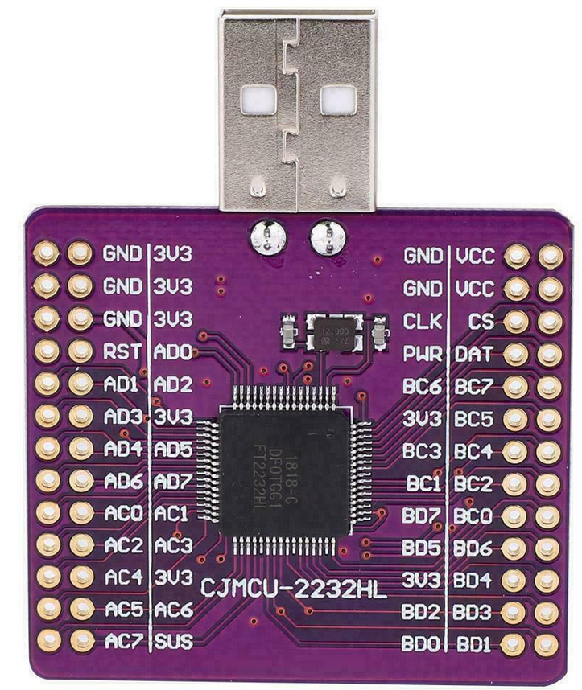
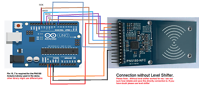

# pypn5180
Python interface for NFC-15693 using NXP pn5180 

Running on linux PC with USB/FTDI interface with python3, or on raspberry-pi with python2.

## Linux PC setup

Dependencies: 

```pip3 install pyftdi setuptools```

refer to  https://eblot.github.io/pyftdi/installation.html for complete install.

then: 

```sudo python3 setup.py install``` 


Connection between ftdi2232 and pn5180 boards

 

Configuration switch between portA and portB to be done in **pypn5180/pypn5180hal.py**:
- **Port A: ftdi://ftdi:2232h/1**
- **Port B: ftdi://ftdi:2232h/2**

| NXP5180 |    FTDI 2232 |
|---------|--------------|
|+5V      |    VCC       |
|+3V3     |    3V3       |
|RST      |    3V3       |
|NSS      |    BD3 / AD3 |
|MOSI     |    BD1 / AD1 |
|MISO     |    BD2 / AD2 |
|SCK      |    BD0 / AD0 |
|BUSY     |    -         |
|GND      |    GND       |
|GPIO     |    -         |
|IRQ      |    -         |
|AUX      |    -         |
|REQ      |    -         |

## Raspberry-pi setup

need spidev-3.2 at least installed on the raspberry

| NXP5180 |  Raspi Header  |
|---------|----------------|
|+5V      |   2 - 5V       |
|+3V3     |   1 - 3V3      |
|RST      |   17- 3V3      |
|NSS      |   24- SPI0-CS0 |
|MOSI     |   19- SPI0-MOSI|
|MISO     |   21- SPI0-MISO|
|SCK      |   23- SPI0-SCLK|
|BUSY     |    -         |
|GND      |   6 - GND    |
|GPIO     |    -         |
|IRQ      |    -         |
|AUX      |    -         |
|REQ      |    -         |


## Usage

``` bash
# Read FRAM block 5
python3 pypn5180_15693.py READBLK -o 5

# Write FRAM block 16 with '0xA1 0xA2 0xA3 0xB4 0xB5 0xB6 0xC7 0xC8'
python3 pypn5180_15693.py WRITEBLK -o 16 -d A1A2A3B4B5B6C7C8
 
# Send a custom or proprietary command 0xA0, with manusacturer id 0x07 and data '0xA1 0xA2 0xA3 0xB4 0xB5 0xB6 0xC7 0xC8'
python3 pypn5180_15693.py CUSTOM -c A0 -m 07 -d A1A2A3B4B5B6C7C8

# Maintain power on for a sensor by RF without sending data
python3 pypn5180_15693.py POWER

# Dump a complete FRAM content, output file 'UUID-Date.dat' is created 
python3 pypn5180_15693.py DUMP

# FreestyleLibre Dump data FRAM part (output file: FREE-UUID-Date.dat)
python3 pypn5180_15693.py FREEDUMP

 ```


