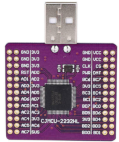
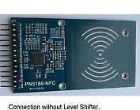

# pypn5180
Python interface for NFC-15693 using NXP pn5180 

Running on linux PC with USB/FTDI interface with python3, or on raspberry-pi with python2.

## Linux PC

Need pyftdi installed: "pip3 install pyftdi"
refer to  https://eblot.github.io/pyftdi/installation.html for complete install.

Connection between ftdi2232 and pn5180 boards

 

Configuration switch between portA and portB to be done in pypn5180/pypn5180hal.py 
    Port A: ftdi://ftdi:2232h/1
    Port B: ftdi://ftdi:2232h/2

| NXP5180 |    FTDI 2232 |
|---------|--------------|
|+5V      |    VCC       |
|+3V3     |    3V3       |
|RST      |    3V3       |
|NSS      |    BD3 / AD3 |
|MOSI     |    BD1 / AD1 |
|MISO     |    BD2 / AD2 |
|SCK      |    BD0 / AD0 |
|BUSY     |    -         |
|GND      |    GND       |
|GPIO     |    -         |
|IRQ      |    -         |
|AUX      |    -         |
|REQ      |    -         |

## Raspberry-pi

need spidev-3.2 at least installed on the raspberry

| NXP5180 |  Raspi Header  |
|---------|----------------|
|+5V      |   2 - 5V       |
|+3V3     |   1 - 3V3      |
|RST      |   17- 3V3      |
|NSS      |   24- SPI0-CS0 |
|MOSI     |   19- SPI0-MOSI|
|MISO     |   21- SPI0-MISO|
|SCK      |   23- SPI0-SCLK|
|BUSY     |    -         |
|GND      |   6 - GND    |
|GPIO     |    -         |
|IRQ      |    -         |
|AUX      |    -         |
|REQ      |    -         |

